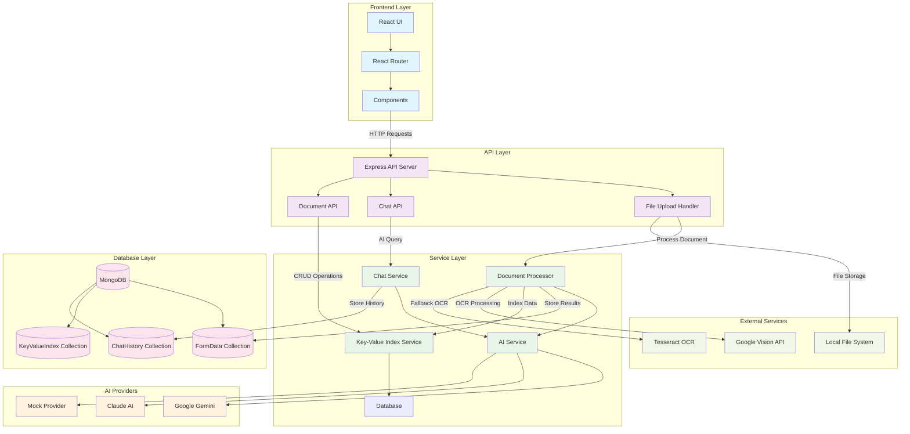
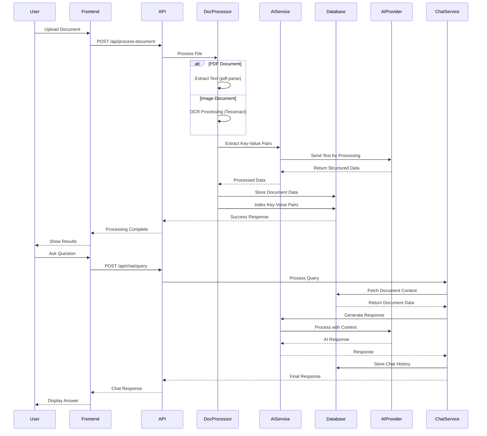
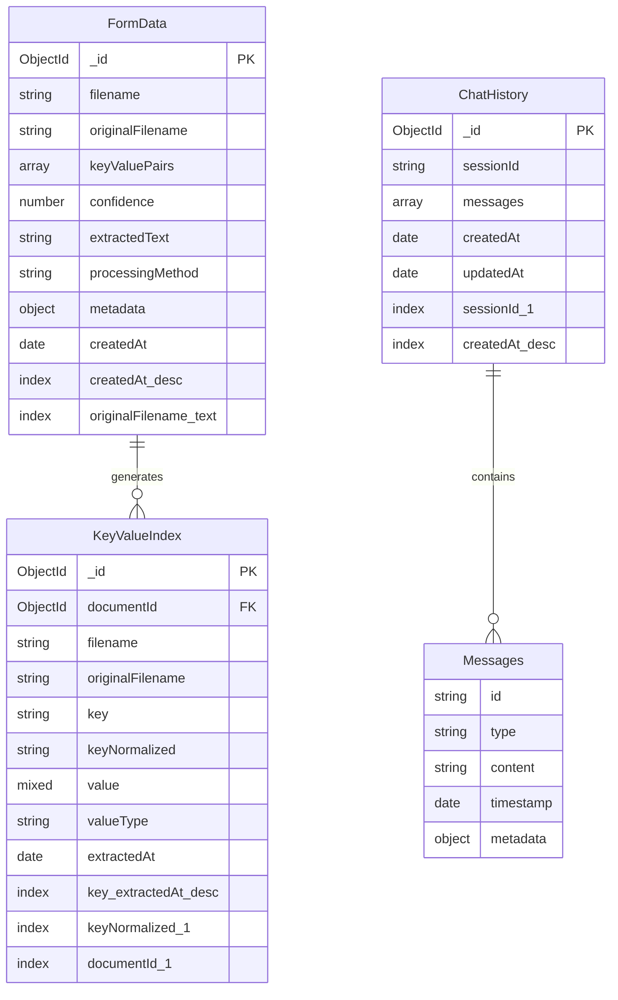
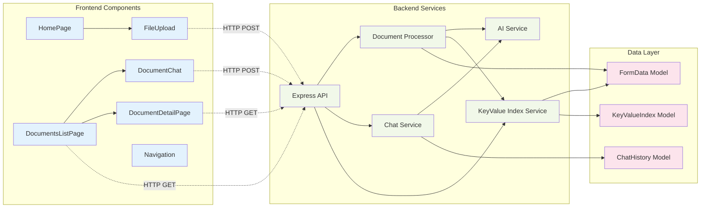
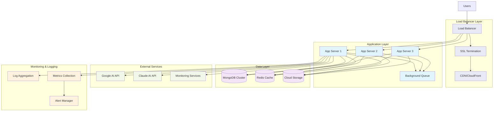
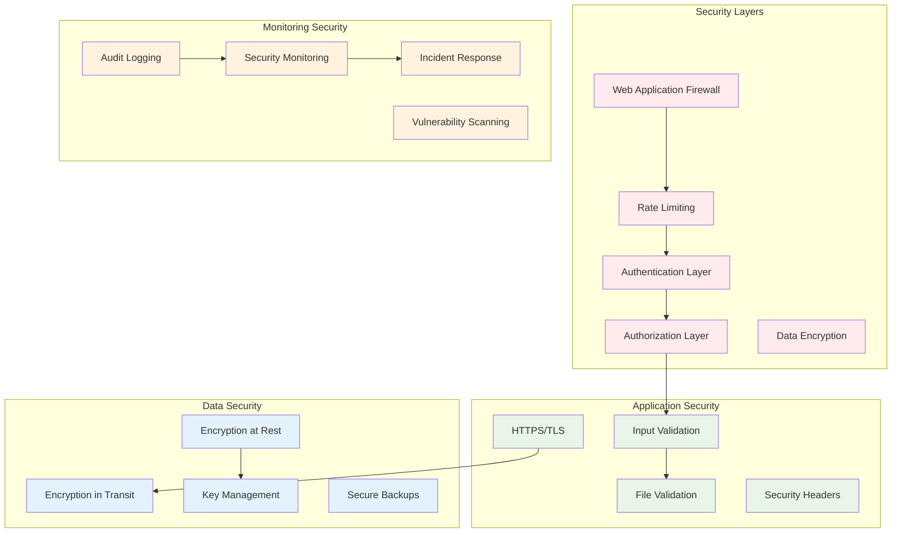

# System Architecture Diagram

## 🏗️ High-Level System Architecture

## 📊 Data Flow Diagram

## 🗄️ Database Schema Diagram

## 🔄 Component Interaction Diagram

## 🚀 Deployment Architecture (Future State)

## 🔐 Security Architecture Diagram

---

*Diagram Version: 1.0*  
*Last Updated: January 2025*  
*Format: Mermaid.js*